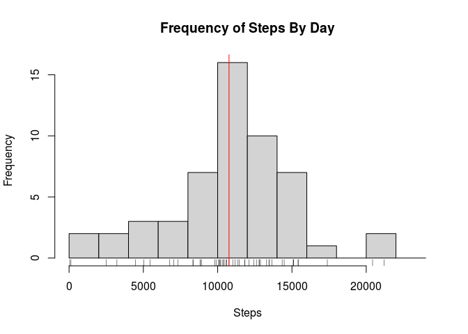
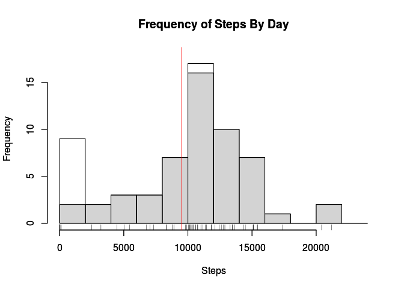

# Reproducible Research: Peer Assessment 1


## Loading and preprocessing the data

```r
data <- read.csv('activity.csv', colClasses=c('numeric', 'POSIXct', 'numeric'))

# the interval is an abbreviated time format. We use the 'sprintf()' trick to left-pad with zeroes so the strptime() function works correctly.
# we force the date to start of epoch so times will overlap.
data[,'datetime'] <- as.POSIXct(strptime(sprintf("%s %04d", data$date, data$interval), format='%Y-%m-%d %H%M'))
data[,'time'] <- as.POSIXct(strptime(sprintf("1970-01-01 %04d", data$interval), format='%Y-%m-%d %H%M'))
data[,'label'] <- strftime(data[,'time'], format='%H:%M')
```


## What is mean total number of steps taken per day?

```r
# group steps by date
stepsByDay <- aggregate(data$steps, by=list(data$date), FUN=sum)
colnames(stepsByDay) <- c('date', 'steps')

# draw a histogram showing the number of steps per day
hist(stepsByDay$steps, xlab='Steps', ylab='Frequency', main='Frequency of Steps By Day', breaks=seq(0, 25000, 2000), col='light gray')
rug(stepsByDay$steps)
abline(v=mean(stepsByDay$steps, na.rm=TRUE), col='red')
```

 

```r
# show mean and median number of steps per day
mean(stepsByDay$steps, na.rm=TRUE)
```

```
## [1] 10766.19
```

```r
median(stepsByDay$steps, na.rm=TRUE)
```

```
## [1] 10765
```

The **mean** number of steps per day is **10766**.

The **median** number of steps per day is **10765**.

## What is the average daily activity pattern?

```r
# we want to ignore 'NA' values.
d <- data[complete.cases(data),]

# group steps by time of day
stepsByTime <- aggregate(d$steps, by=list(d$time), FUN=mean)
colnames(stepsByTime) <- c('time', 'steps')
stepsByTime[,'label'] <- strftime(stepsByTime[,'time'], format='%H:%M')

# plot time series
plot.ts(stepsByTime$steps, x=stepsByTime$time, plot.type='single', type='l', xlab='Time of Day (seconds since midnight)', ylab='Steps', main='Average number of steps by time of day')
```

 

The data has labels in proper 'HH:MM' format but I have been unable to figure out how to force the plot to use these labels.


```r
# find five minute period with greatest number of steps.
stepsByTime[stepsByTime$steps == max(stepsByTime[,'steps']), 'label']
```

```
## [1] "08:35"
```

The five minute period with the greatest number of steps starts at
**08:35**.

## Imputing missing values


```r
# count number of rows with missing data
nrow(data[is.na(data$steps),])
```

```
## [1] 2304
```

**2304** rows have missing data.


```r
# create new column where we replace NAs with average number of steps at that time of day.
data[,'fixed'] <- ifelse(is.na(data$steps), stepsByTime[data$time == stepsByTime$time, 'steps'], data$steps)

# there's still a handful of NAs. Set their values to null.
data[,'fixed'] <- ifelse(is.na(data$fixed), 0, data$fixed)
nrow(data[is.na(data$fixed),])
```

```
## [1] 0
```

```r
# make sure the results are reasonable
sprintf('number of steps. old = %.0f, new = %0.f', sum(data$steps, na.rm=T), sum(data$fixed))
```

```
## [1] "number of steps. old = 570608, new = 581374"
```

```r
# group steps by date
fixedStepsByDay <- aggregate(data$fixed, by=list(data$date), FUN=sum)
colnames(fixedStepsByDay) <- c('date', 'steps')
```

Histogram of average number of steps per day. The original data is shown in light gray, the new data is white.


```r
# draw a histogram showing the number of steps per day
hist(stepsByDay$steps, xlab='Steps', ylab='Frequency', main='Frequency of Steps By Day', breaks=seq(0, 25000, 2000), ylim=c(0,18), col='light gray')

par(new=T)
hist(fixedStepsByDay$steps, xlab='Steps', ylab='Frequency', main='Frequency of Steps By Day', breaks=seq(0, 25000, 2000), ylim=c(0,18))
rug(fixedStepsByDay$steps)
abline(v=mean(fixedStepsByDay$steps, na.rm=TRUE), col='red')
```

 

The **mean** number of adjusted steps per day is **9531**.

The **median** number of adjusted steps per day is **10439**.


```r
## Are there differences in activity patterns between weekdays and weekends?
```

```r
weekdays <- factor(c('Weekend', 'Weekday'), labels=c('Weekend', 'Weekday'))
data[,'dow'] <- as.factor(weekdays(data$date))
data[,'weekend'] <- as.factor(ifelse(data[,'dow'] == 'Saturday' | data[,'dow'] == 'Sunday', 'Weekend', 'Weekday'))

dd <- data[data$weekend=='Weekend',]
weekendStepsByTime <- aggregate(dd$fixed, by=list(dd$time), FUN=mean)
colnames(weekendStepsByTime) <- c('time', 'steps')

dd <- data[data$weekend=='Weekday',]
weekdayStepsByTime <- aggregate(dd$fixed, by=list(dd$time), FUN=mean)
colnames(weekdayStepsByTime) <- c('time', 'steps')

df <- weekendStepsByTime$steps
df <- cbind(df, weekdayStepsByTime$steps)
colnames(df) <- c('weekend', 'weekday')
plot.ts(ts(df), plot.type='multiple', type='l', ylab=c('Steps','Steps'), xlab='Interval (count since midnight)', main='Average number of steps by time of day', yax.flip=T)
```

 

Note that the y-coordinates are different on each plot. It's subtle but important. (The 'ylim' coordinate is not working as expected.)
